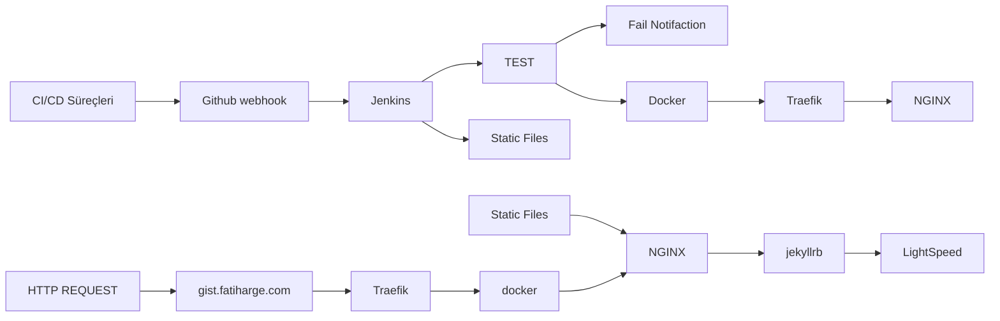

# gist.fatiharge.com

Konuları küçük parçalara bölerek hatırlatıcı notlar halinde yayınlamak amacıyla hazırlanmıştır.

## İçerik Hakkında

gist.fatiharge.com, bilgilendirici içerikleri hızlıca hatırlatıcı notlar şeklinde sunmak için geliştirilmiştir. 

## Teknolojiler Hakkında
Jekyll tabanlı **LightSpeed** teması, sade yapıya sahiptir. Tüm kaynak dosyaları bu repoda yer almaktadır. Sunucu yapılandırmasında, statik dosyalar bir NGINX Docker konteyneri üzerinde çalışmaktadır. Reverse proxy olarak ise Traefik kullanılmakta ve CI/CD süreçleri Jenkins üzerinden yönetilmektedir.

> **İletişim:** fatih@fatiharge.com